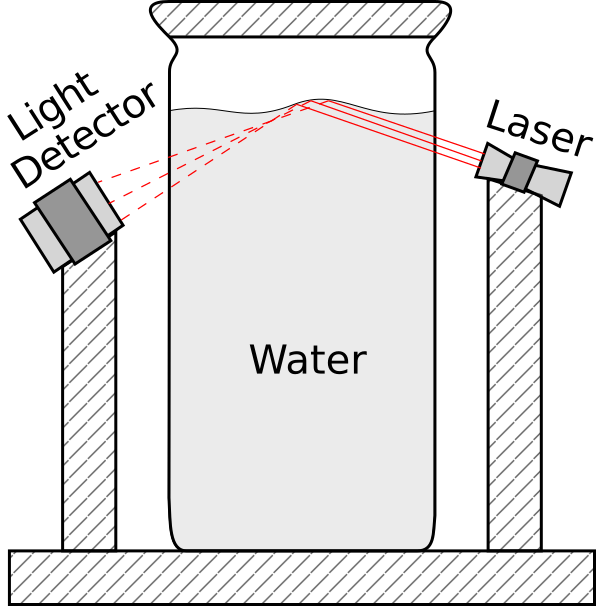

.. Earthquake Sensor documentation master file, created by
   sphinx-quickstart on Sun May 24 12:18:02 2020.
   You can adapt this file completely to your liking, but it should at least
   contain the root `toctree` directive.

**********************
**Earthquake Sensor**
**********************

.. toctree::
   :maxdepth: 2
   :caption: Contents:
   

.. 
    .. math:: 
        p+p \to \pi^0 \to \gamma
        :label: euler

.. 
    .. seealso:: 
        .. math:: 
            p+p \to \pi^0 \to \gamma
            :label: euler

**Abstract**
============

Here we describe a simple and low cost sensor that is sensitive of low amplitude ground shaking. The sensor can be utilized as a home made early warning earthquake device.

**Introduction**
================

For a liquid-air boundary, the critical angle for the total internal reflection is determined by the liquid refraction index. If the surface of the liquid is unperturbed, the reflection of light rays is the same in every point of the surface. However, if local perturbations are introduced, the reflectance of that area can changes significantly, by changing the intensity of the expected light reflected in a given direction.
 
Small amplitude shakes of the liquid container results on ripples formation that can significantly alter the reflection properties of the liquid surface. These ripples are result of the capillary waves formed due to the surface tension of the liquid-air boundary. Therefore, by shining a laser on a given point of the liquid surface, the intensity of the reflected light is sensitive on little shakes of the container. We want to utilize this phenomenon to build a sensor for early warning of earthquakes. 

**Hardware**
============

The sensor we suggest here is shown in :numref:`sensor`. It consist of a transparent container filled with water. A light beam that is emitted from a laser that inters in the water and has a direction that hits the water-air boundary at an angle greater than the critical angle :math:`(\theta > \theta_c)`. As a result, the light beam is totally reflected in the water which then leaves the container and hits a photodetector -- such as a photoresistor -- that measures the intensity of light. The photodetector is connected with the necessary electronics that facilitate signal processing, data acquisition and decision making. 

If the water-air boundary is in equilibrium, the light reaching the photodetector is constant. When ripples are produced, they change the shape of the water-air boundary and therefore, the reflected light disperses by changing the intensity of light reaching the photodetector. The evolution of the ripples follow the time dependence of the external force and therefore, the time variation of the reflected light intensity follow the time evolution of the external force. The sensor measures the light intensity to reconstruct the time dependence of the external force and then to distinguish if this force originates from a major earthquake and to decide if needs to alarm the users. 

.. _sensor:

    
    . The earthquake sensor is composed of: 
    1. A transparent container filled with water. 
    2. A laser beam that is reflected from the water-air boundary. 
    3. A photodetector that measures the intensity of the reflected light.
    4. The necessary electronics for data acquisition and decision making.

**Why should this work**
========================

Vibrations of the container produce surface waves in the liquid of a capillary-gravity nature that satisfy the following dispersion relation:

.. math:: \omega^2 = (g\, k + \frac{\sigma}{\rho}\,k^3)\,\tanh(k\,h).
    :label: eqDispersGC

Here :math:`\omega` is the angular frequency, :math:`k` is the wave number, :math:`g` is the gravitational acceleration, :math:`h` is the depth of the liquid in the container, :math:`\sigma` is the liquid surface tension and :math:`\rho` is the liquid mass density. Eq.:ref:`eqDispersGC` assumes a liquid-air interface. For the water-air interface :math:`\sigma=7.4\,{\rm mN/m}` and :math:`\rho=10^3\,{\rm kg/m^3}` we find the critical :math:`k_c=\sqrt{g\,\rho/\sigma}=1.15\times 10^3\,{\rm m^{-1}}` for which we switch between capillary and gravitational waves regimes. Therefore, for wavelengths :math:`\lambda\ll 5\,{\rm mm}` the waves are in capillary regime, whereas, for larger wavelengths it switches to a gravity regime.

Free wave equation :math:`\square \Psi = 0` is solved by variable separation method :math:`\Psi(t,\vec{r})=T(t)\times R(\vec{r})`, where, :math:`T(t)` and :math:`R(\vec{r})` are the functional parts that depend only on the time or spatial coordinates, respectively. Consider a cylindrical container of radius :math:`R` with its axis aligned vertically -- i.e. it has radial symmetry in the horizontal plane. Vibrational forces :math:`f(t)` that acts on the container produce waves that satisfy :math:`\square \Psi = f(t)`. At a fixed spatial point on the liquid-air surface (e.g. the center of the free surface :math:`\vec{r}=0`), the time dependence of the solution is a function of the :math:`\Psi(t,0) =\Psi_{\rm free}(t,0) +  \int f(t)\, dt`, i.e. it depends on the speed by witch the container shakes. 

**Electronics**
===============

The sensor has two separate electrical circuits. The first circuit energizes a low power laser (with :math:`P\leq 5\,{\rm mW}`). The second circuit is the data acquisition system that includes a photodetector, a microcontroller and the necessary electrical hardware to connect them, as well as, all the necessary software for the data pipeline, data analysis and decision making.

.. _schematics:

.. figure:: Earthquake_Schematics.png
    :width: 70%
    :align: center
    :alt: Sensor geometry
    
    . Schematic connection of the electrical components of the earthquake sensor. The *power* module is a battery, the *microcontroller* (:math:`\mu` controller) such as a low cost arduino and ESP32, the *photodetector* can be a photodiode or photoresistor and other electrical components to connect to the microcontroller. The *laser* is a low power photodiode laser. The *water container* is shown in :numref:`sensor`.

:numref:`schematics`

**Sensitivity**
===============

